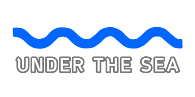
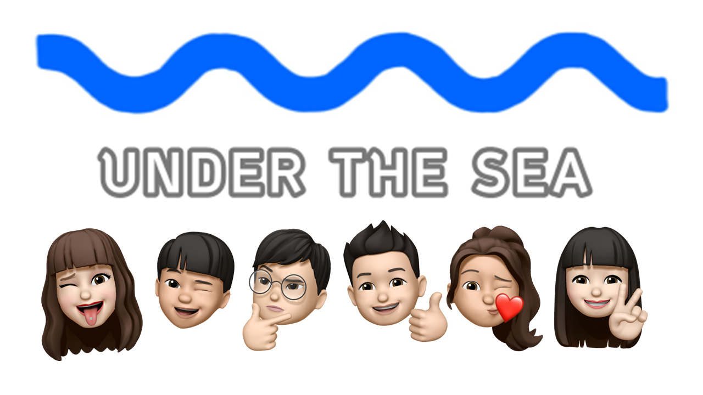
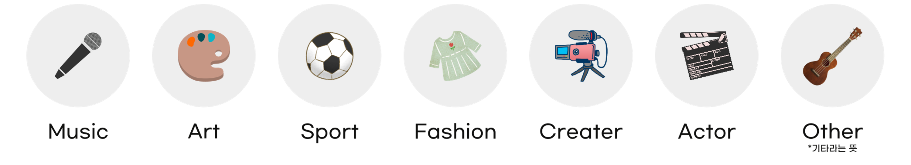
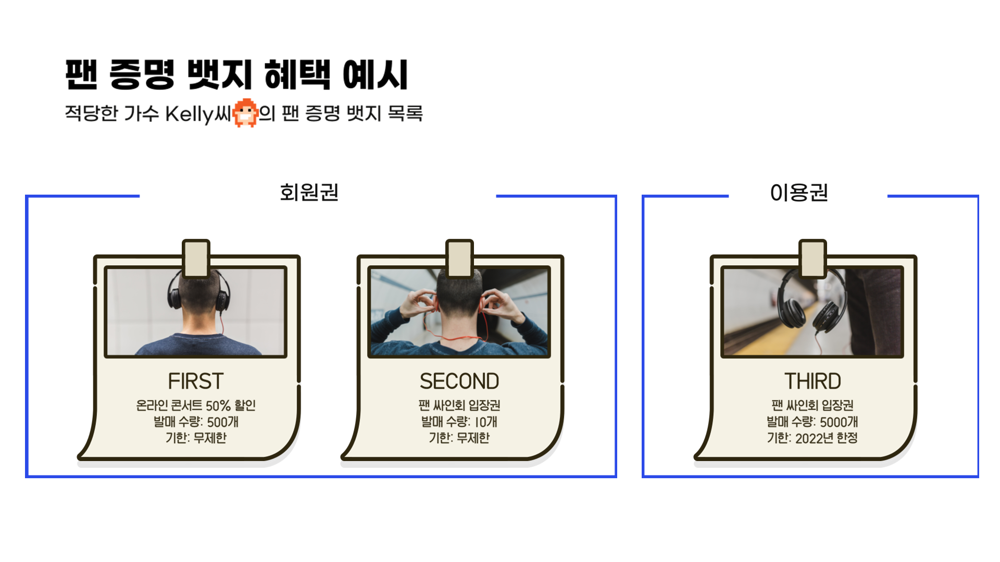
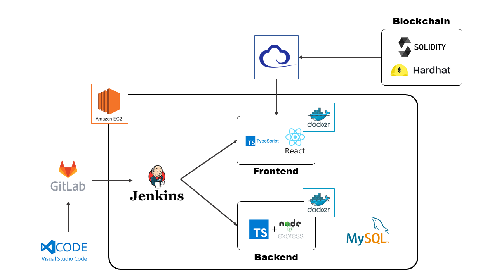

# UTS

<br/>

<div align="center"></div><br>
<div align="center">아티스트와 팬의 만남의 장, <b>UTS</b></div>
<br/>

---

## **프로젝트 목차**

[UTS](#UTS)

- [프로젝트 목차](#프로젝트-목차)
- [팀 소개](#팀-소개)
- [팀 이름](#팀-이름)
- [팀원 소개](#팀원-소개)
- [프로젝트 소개](#프로젝트-소개)
  - [1️⃣ 주제](#1️⃣-주제)
  - [2️⃣ 프로젝트](#2️⃣-프로젝트)
  - [3️⃣ 기술 스택](#3️⃣-기술-스택)
  - [4️⃣ 프로젝트 구조](#4️⃣-프로젝트-구조)
  - [5️⃣ 프로젝트 산출물](#5️⃣-프로젝트-산출물)
  - [6️⃣ 프로젝트 제출물](#6️⃣-프로젝트-제출물)
- [프로젝트 영상](#프로젝트-영상)
  <br/>

---

## **팀 소개**

### - 팀 이름



깊은 바닷속처럼 무한한 세상이 펼쳐질 NFT 거래소

### - 팀원 소개

| 이름   | 직책 | 역할                 | 담당                             |
| ------ | ---- | -------------------- | -------------------------------- |
| 연진우 | 팀장 | Frontend, BlockChain | React, EC2 서버 통신             |
| 남정현 | 팀원 | Backend, BlockChain  | DB 설계, 배포, 스마트 컨트랙트   |
| 백승윤 | 팀원 | Frontend, BlockChain | React, Story book 제작, 스마트 컨트랙트 |
| 오재우 | 팀원 | Backend, BlockChain  | DB 설계, 프로젝트 구조 설계      |
| 정현정 | 팀원 | Frontend, BlockChain | React, EC2 서버 통신             |
| 황수진 | 팀원 | Backend, BlockChain  | DB 설계, CI/CD 및 인프라 구축    |

<br/>

## **프로젝트 소개**

### 1️⃣ 주제

- NFT
  ```
  - Non-Fungible Token
      - 교환과 복제가 불가능하여 저마다 고유성과 희소성을 지니는 블록체인 기반의 토큰입니다.
      - 영상, 그림 등을 복제 불가능한 콘텐츠로 만들 수 있어 신종 디지털 자산으로 주목받고 있습니다.
  ```
- HOW
  ```
  - DApp(탈중앙화)을 적용하여 아티스트와 팬이 직접 소통하는 생태계를 구축하고자 합니다.
  - 팬 증명 뱃지에 혜택을 담아 NFT로 만들어, 사고 파는 행위를 통해 해당 토큰의 소장 가치를 담고자 합니다.
  ```
- NEEDS

  ```
  - 적당한 가수 Kelly
    - 대형 플랫폼에서 높은 수수료로 인해 실수익이 적은 아티스트
    - 본인의 팬에게 직접적인 혜택을 주고 싶은 아티스트

  - Kelly의 열성 팬 Amy
      - 꾸준한 수익 창출을 지원하여 Kelly의 음악을 오래 듣고 싶은 팬
      - 팬 증명 뱃지를 통해 직접적인 혜택을 받고 싶은 팬

  - 환경과 K-pop에 관심 많은 Amanda
    - 인기 많은 KPOP 가수의 팬싸인회에 가기 위해 음원 CD를 수백장씩 구매하면서도 자원 낭비 걱정이 많은 환경을 생각하는 팬
  ```

### 2️⃣ 프로젝트

#### 아티스트 분류


<br>

#### 팬 증명 뱃지 혜택



- 각 뱃지별로, 혜택 및 기한, 수량 등은 모두 아티스트의 선택 사항

### 3️⃣ 기술 스택



<br>

- `FrontEnd` :    
- `BackEnd` :    
- `BlockChain` :   
- `DevOps` :     <br>
- `UI` :   

### 4️⃣ 프로젝트 구조

**FrontEnd**

```
uts-fronted
└── src
	├── components
	│      ├── header
	│      │      └── navbar
	│      │             ├── index.tsx
	│      │             ├── style.ts
	│      │             └── Navbar.tsx
	│      |── contents
	│      │      ├── main
	│      │      │      ├── hotArtist
	│      │      │      ├── hotBadge
	│      │      │      ├── topSeller
	│      │      │      └── onboarding
	│      │      ├── user
	│      │      │      ├── login
	│      │      │      ├── signUp
	│      │      │      ├── findId
	│      │      │      └── findPw
	│      │      ├── about
	│      │      │      └── about
	│      │      ├── profile
	│      │      │      └── profile
	│      │      ├── artist
	│      │      │      └── artist
	│      │      ├── badge
	│      │      │      └── badge
	│      │      ├── artistDetail
	│      │      |      └── artistDetail
	│      │      ├── badgeDetail
	│      │      |      └── badgeDetail
	│      │      ├── edition
	│      │      |      └── edition
	│      │      ├── minting
	│      │      └── admin
	│      └── footer
	│                └── footer
	│                       └── Footer.tsx
	└── pages
        	├── header
        	│      └── Header.tsx
        	├── contents
        	│      ├── Main.tsx
        	│      ├── User.tsx
        	│      ├── About.tsx
        	│      ├── Profile.tsx
        	│      ├── Artist.tsx
        	│      ├── ArtistDetail.tsx
        	│      ├── Badge.tsx
        	│      ├── BadgeDetail.tsx
        	│      ├── Edition.tsx
        	│      ├── Minting.tsx
        	│      └── Admin.tsx
        	└── footer
```

**BackEnd**

```
uts-backend
├── src
│	├── config
│	├── models
│	├── pre-start
│	│      └── env
│	│            ├── development.env
│	│            ├── production.env
│	│            └── test.env
│       │
│	├── public
│	│      ├── scripts
│	│      └── stylesheets
│       │
│	├── repos
|       |     	├── artist-repo.ts
|       |     	├── common_code-repo.ts
|       |     	├── edition-repo.ts
|       |     	├── follow-repo.ts
|       |     	├── heart-repo.ts
|       |     	├── nft-repo.ts
|       |     	├── nft-sorting-repo.ts
|       |     	├── report-repo.ts
|       |     	├── sale-repo.ts
|       |     	└── user-repo.ts
│       │
│	├── routes
│	│      ├── admin.ts
│	│      ├── api.ts
│	│      ├── artist-router.ts
│	│      ├── edition-router.ts
│	│      ├── follow-router.ts
│	│      ├── heart-router.ts
│	│      ├── main-router.ts
│	│      ├── market-router.ts
│	│      ├── nft-router.ts
│	│      ├── sale-router.ts
│	│      ├── search-router.ts
│	│      └── user-router.ts
│       │
│	├── services
│	│      ├── admin-service.ts
│	│      ├── artist-service.ts
│	│      ├── edition-service.ts
│	│      ├── follow-service.ts
│	│      ├── heart-service.ts
│	│      ├── main-service.ts
│	│      ├── market-service.ts
│	│      ├── nft-service.ts
│	│      ├── sale-service.ts
│	│      ├── search-service.ts
│	│      └── user-service.ts
│       │
│	├── shared
│	├── views
│	│
│	├── index.ts
│	└── server.ts
│
├── package.json
└── tsconfig.json
```

### 5️⃣ 프로젝트 산출물

- [기획](./docs/기획.md)
- [Notion](./docs/notion.md)
- [Jira](./docs/jira.md)
- [ERD](./docs/erd.md)

### 6️⃣ 프로젝트 제출물

- [외부서비스](./exec/UTS_외부서비스.pdf)
- [시연시나리오](./exec/A105_UTS_시연시나리오.pdf)
- [빌드배포](./exec/UTS_빌드_배포_정리.pdf)

## **프로젝트 영상**

[](https://youtu.be/7gjpJt1W428)
